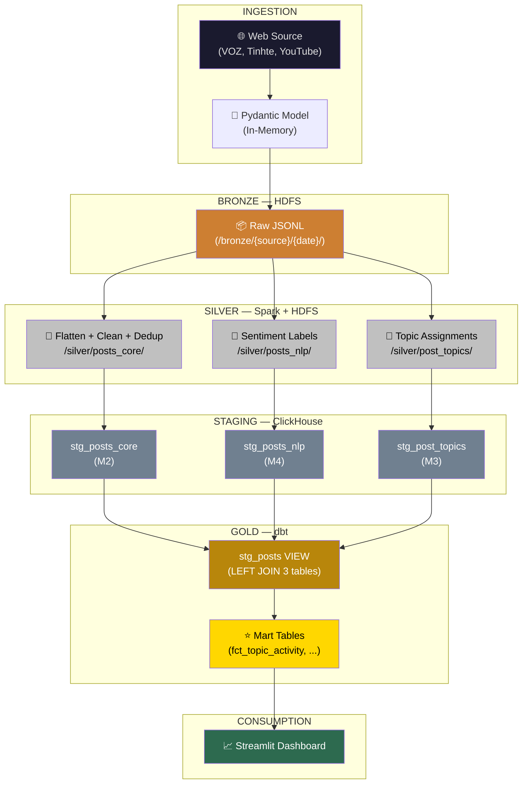

# Data Flow & Schema Evolution
## Vietnamese Tech Trend & Controversy Radar

> **Document Type:** Data Architecture — Schema Lineage & State Transitions
> **Date:** April 2026
> **Scope:** Full lifecycle of a social media post from raw extraction to aggregated Trend Score & Crisis Alert

---

## Overview — The Medallion Pipeline

A single social media post traverses **8 distinct data states** across 4 infrastructure layers before reaching the dashboard. At each stage, the schema mutates — fields are added, dropped, normalized, or aggregated — as raw noise is refined into analytical signal.



---

## Stage 1 — Raw Extraction (In-Memory)

| Attribute | Value |
|-----------|-------|
| **Layer** | Ingestion — Python Crawlers |
| **Infrastructure** | Python process on master node |
| **Data State** | Unstructured/semi-structured dict in memory |
| **Format** | Python `dict` → Pydantic model |

### Schema Contract

Each source produces a **different raw shape**. The Pydantic models enforce minimum structure before any data hits disk.

#### VOZ Forum Post

```
Field              Type              Notes
─────────────────  ────────────────  ────────────────────────────────────
post_id            str               Canonical PK: thread ID + post index (e.g., "t12345_p3")
title              str               Thread title (empty for replies)
content            str               Raw HTML body — includes , <a>, emoji
author             str               VOZ username
timestamp          datetime          Post creation time
source             str (literal)     "voz"
reactions          dict              {"like": 5, "love": 0, "haha": 2, ...}
comments           list[dict]        Nested reply chain — recursive structure
url                str               Full thread URL
```

#### Tinhte Forum Post

```
Field              Type              Notes
─────────────────  ────────────────  ────────────────────────────────────
post_id            str               Tinhte thread/comment ID
title              str               Article or thread title
content            str               Raw HTML/markdown body
author             str               Tinhte username
timestamp          datetime          Creation time
source             str (literal)     "tinhte"
reactions          dict              {"like": N, ...}
comments           list[dict]        Nested comments
url                str               Full post URL
```

#### YouTube Comment

```
Field              Type              Notes
─────────────────  ────────────────  ────────────────────────────────────
post_id            str               Canonical PK: YouTube comment ID
video_id           str               Parent video ID
channel            str               Channel name (e.g., "VatVoStudio")
comment_text       str               Plain text comment
author             str               YouTube display name
likes              int               Comment like count
replies            list[dict]        Nested reply threads
published_at       datetime          Comment publish time
source             str (literal)     "youtube"
```

### Key Transformations

- **Cloudflare bypass** (VOZ) via `undetected-chromedriver` / `cloudscraper`
- **YouTube API quota management** — 10,000 units/day limit, priority queue by engagement
- **Pydantic validation** — enforces required fields, type coercion, rejects malformed records
- **No cleaning** — raw HTML, teencode slang, and emoji are preserved intentionally

### Schema Design Rationale

> Each source has unique fields (`video_id`, `reactions`, `channel`) that are source-specific. The Pydantic models do **not** unify them yet — normalization happens in Spark (Stage 3). This preserves maximum fidelity at the Bronze layer.

---

## Stage 2 — Bronze Layer (HDFS Raw JSONL)

| Attribute | Value |
|-----------|-------|
| **Layer** | Bronze — Data Lake |
| **Infrastructure** | HDFS (NameNode + 3 DataNodes, replication factor = 2) |
| **Data State** | Raw, immutable, append-only |
| **Format** | JSONL (one JSON object per line) |
| **Path** | `/data/bronze/{source}/date={YYYY-MM-DD}/batch_{N}.jsonl` |

### Schema Contract

Identical to Stage 1 — the JSON serialization of each Pydantic model. No schema mutation occurs.

```
HDFS Directory Structure:
/data/bronze/
├── voz/
│   └── date=2026-03-15/
│       ├── batch_001.jsonl     (~10K records)
│       └── batch_002.jsonl
├── tinhte/
│   └── date=2026-03-15/
│       └── batch_001.jsonl
├── vnexpress/
│   └── date=2026-03-15/
│       └── batch_001.jsonl
└── youtube/
    └── date=2026-03-15/
        └── batch_001.jsonl
```

### Example Record (VOZ)

```json
{
  "post_id": "t987654_p1",
  "title": "Review iPhone 16 Pro Max sau 3 tháng sử dụng",
  "content": "<p>Mình xài con <b>iPhone 16 Pro Max</b> được 3 tháng r, nói chung là...</p>",
  "author": "techreview_vn",
  "timestamp": "2026-03-15T14:30:00+07:00",
  "source": "voz",
  "reactions": {"like": 45, "love": 12, "haha": 0},
  "comments": [
    {
      "comment_id": "t987654_p1_c1",
      "author": "fan_android",
      "content": "giá đó mua Samsung đc 2 con luôn bro =))",
      "timestamp": "2026-03-15T14:35:00+07:00",
      "reactions": {"like": 23}
    }
  ],
  "url": "https://voz.vn/t/review-iphone-16.987654/"
}
```

### Key Transformations (Stage 1 → Stage 2)

| Transformation | Description |
|----------------|-------------|
| Pydantic → JSON serialization | Python objects serialized to JSONL |
| Date partitioning | Written to `/date={YYYY-MM-DD}/` based on crawl date |
| HDFS write via WebHDFS | `pyarrow.fs.HadoopFileSystem` or `hdfs` Python client |
| Append-only semantics | No updates/deletes — each crawl batch is a new file |

### What This Stage Does NOT Do

- ❌ No deduplication (same post may appear in multiple batches)
- ❌ No text cleaning (raw HTML preserved)
- ❌ No schema unification across sources
- ❌ No null handling

---

## Stage 3 — Silver Layer, Step 1: Flatten, Clean & Dedup (Spark → HDFS Parquet)

| Attribute | Value |
|-----------|-------|
| **Layer** | Silver — Distributed Processing (**Member 2 ownership**) |
| **Infrastructure** | Apache Spark 3.5+ (PySpark), 3 executors × 4 cores × 8GB |
| **Data State** | Structured, flattened, deduplicated, cleaned — **no ML labels yet** |
| **Format** | Apache Parquet (columnar, snappy compression) |
| **Path** | `/data/silver/posts_core/date={YYYY-MM-DD}/` |

### Schema Contract — After Flattening + Cleaning + Dedup

The nested, source-specific JSON is exploded into a **unified flat schema** with **atomic engagement metrics preserved**. Every comment/reply becomes its own row.

```
Field              Type              Source            Notes
─────────────────  ────────────────  ───────────────   ────────────────────────────────────
post_id            String            ALL               Canonical PK across all stages
source             String            ALL               'voz' | 'tinhte' | 'vnexpress' | 'youtube'
author             String            ALL               Username/display name
title              String (nullable) VOZ,Tinhte,VnExp  Thread/article title; NULL for comments
body               String            ALL               Raw text content (cleaned of HTML)
clean_text         String            ALL               Lowercase, no URLs/emojis/HTML, teencode→standard
segmented_text     String            ALL               VnCoreNLP output ("học_sinh thích điện_thoại")
parent_id          String (nullable) ALL               post_id of parent; NULL if top-level
reaction_count     Int32             ALL               Likes/reactions (atomic — NOT aggregated)
comment_count      Int32             ALL               Direct replies count (atomic)
view_count         Int32 (nullable)  YouTube only      Video/post views; NULL for sources without views
created_at         DateTime          ALL               Original post creation timestamp
crawled_at         DateTime          ALL               When the crawler fetched this record
```

> [!IMPORTANT]
> **The ELT Rule — Atomic Metrics:** Spark preserves `reaction_count`, `comment_count`, and `view_count` as separate columns. It does **NOT** compute `engagement = f(reactions, comments, views)`. That business logic belongs in dbt (Stage 7), where the formula can be tuned via SQL without rerunning the Spark pipeline.

### Key Transformations (Stage 2 → Stage 3)

| # | Transformation | Logic | Fields Affected |
|---|----------------|-------|-----------------|
| 1 | **Comment explosion** | Nested `comments[]` and `replies[]` arrays are exploded via `pyspark.sql.functions.explode`. Each comment becomes a separate row with `parent_id` pointing to its parent `post_id`. | `post_id`, `parent_id` (new) |
| 2 | **Schema unification** | Source-specific fields mapped to common schema: `comment_text` → `body`, `published_at` → `created_at`. **Metric fields mapped atomically**: `reactions.like+love+haha` → `reaction_count`, `len(comments)` → `comment_count`, YouTube `viewCount` → `view_count`. | All |
| 3 | **HTML stripping** | `<p>`, `<b>`, ``, `<a>` tags removed via regex. URLs extracted and discarded. | `body` |
| 4 | **Text normalization** | Lowercase conversion, emoji removal, special character normalization, number standardization. | `clean_text` (new) |
| 5 | **Teencode dictionary** | ~5,000 slang mappings applied: `"đt"` → `"điện_thoại"`, `"bro"` → `"anh_em"`, `"r"` → `"rồi"`. | `clean_text` |
| 6 | **Vietnamese word segmentation** | VnCoreNLP via Pandas UDF: `"học sinh"` → `"học_sinh"`. Fallback to `underthesea` if Java unavailable. | `segmented_text` (new) |
| 7 | **MinHash/LSH deduplication** | k=5 shingles → 128 hash functions → 16 bands × 8 rows → Jaccard ≥ 0.8 threshold. Keeps earliest `post_id` per duplicate cluster. ~10–30% row reduction. | Rows removed |
| 8 | **Stopword removal** | Vietnamese stopwords (~500+ words) removed from `clean_text`. | `clean_text` |

### Fields Dropped (from Bronze)

| Dropped Field | Reason |
|---------------|--------|
| `reactions` (dict) | Decomposed into atomic `reaction_count` (sum of all reaction types) |
| `comments` (nested list) | Exploded into individual rows; count preserved as `comment_count` |
| `replies` (nested list) | Exploded into individual rows |
| `url` | Not needed for analytics |
| `video_id`, `channel` | YouTube-specific; `source = 'youtube'` is sufficient discrimination |

### Fields Gained

| New Field | Source |
|-----------|--------|
| `clean_text` | Text preprocessing pipeline output |
| `segmented_text` | VnCoreNLP word segmentation |
| `parent_id` | Derived from comment nesting hierarchy |
| `reaction_count` | Atomic: sum of like/love/haha from `reactions` dict |
| `comment_count` | Atomic: count of direct child comments |
| `view_count` | Atomic: YouTube `viewCount`; NULL for other sources |

---

## Stage 4 — Silver Layer, Step 2: Decoupled NLP Enrichment (Spark → HDFS Parquet)

| Attribute | Value |
|-----------|-------|
| **Layer** | Silver — NLP & ML Processing |
| **Infrastructure** | Spark `mapPartitions` (PhoBERT, **M4**), GPU node (BERTopic, **M3**) |
| **Data State** | Two **separate** Parquet outputs — sentiment and topics are NOT merged into posts_core |
| **Format** | Parquet |

### The Decoupling Principle

> [!IMPORTANT]
> **NLP outputs write to separate HDFS paths, NOT back into `posts_core`.** Each team member's Spark job produces its own output keyed by `post_id`. The JOIN happens in dbt (Stage 6), not in Spark. This eliminates cross-job Spark shuffles and allows independent retries.

```
HDFS Silver Layer — 3 Decoupled Outputs:

/data/silver/
├── posts_core/date={YYYY-MM-DD}/    ← M2: Flatten + Clean + Dedup (Stage 3)
├── posts_nlp/date={YYYY-MM-DD}/     ← M4: Sentiment labels (this stage)
└── post_topics/date={YYYY-MM-DD}/   ← M3: Topic assignments (this stage)
```

### Schema Contract — `/silver/posts_nlp/` (Member 4 output)

```
Field              Type              Notes
─────────────────  ────────────────  ────────────────────────────────────
post_id            String            FK → posts_core.post_id
sentiment_label    String            PhoBERT output: 'positive'|'negative'|'neutral'
sentiment_score    Float32           Model confidence: 0.0–1.0
model_version      String            e.g., "phobert_v1.2"
predicted_at       DateTime          Inference timestamp
```

### Schema Contract — `/silver/post_topics/` (Member 3 output)

```
Field              Type              Notes
─────────────────  ────────────────  ────────────────────────────────────
post_id            String            FK → posts_core.post_id
topic_id           Int32             LDA/BERTopic assignment
topic_probability  Float32           Assignment confidence: 0.0–1.0
model_type         String            'lda' | 'bertopic'
predicted_at       DateTime          Inference timestamp
```

### Schema Contract — Topics Lookup Table (`/silver/topics/`)

```
Field              Type              Notes
─────────────────  ────────────────  ────────────────────────────────────
topic_id           Int32             Unique topic identifier
label              String            Human-readable label (e.g., "iPhone reviews")
top_keywords       Array(String)     Top 10 words by c-TF-IDF weight
coherence_score    Float32 (null.)   Topic quality metric
model_version      String            "lda_v1" or "bertopic_v2"
created_at         DateTime          When topic model was trained
```

### Key Transformations (Stage 3 → Stage 4)

| # | Transformation | Owner | Engine | Details |
|---|----------------|-------|--------|---------|
| 1 | **Sentiment Classification** | M4 | PhoBERT (`vinai/phobert-base` fine-tuned) | 3-class: positive/negative/neutral. Distributed via `mapPartitions` — model loaded once per executor partition, batch_size=32, max_length=256 tokens. **Reads** `posts_core`, **writes** `posts_nlp`. No shuffle — reads and writes are partition-aligned. |
| 2 | **Topic Modeling (LDA)** | M3 | Spark MLlib | k=20 topics, maxIter=50, optimizer="em". Runs daily. **Reads** `posts_core.segmented_text`, **writes** `post_topics`. |
| 3 | **Topic Modeling (BERTopic)** | M3 | GPU node (standalone) | PhoBERT embeddings → UMAP → HDBSCAN → c-TF-IDF. Runs weekly. **Writes** to `post_topics` replacing LDA assignments. |
| 4 | **Keyword Frequency** | M3 | Count-Min Sketch (CS246) | Custom implementation: depth=5, width=4096, MurmurHash3. Outputs Top-K keywords per 1-hour sliding window → separate `keyword_freq` path. |

### Why Decoupled Outputs Eliminate Spark Shuffle

```
❌ MONOLITHIC (ETL anti-pattern):
  posts_core ──┐
  posts_nlp  ──┼── Spark JOIN (shuffle by post_id) ──→ single stg_posts table
  post_topics ─┘

✅ DECOUPLED (ELT pattern):
  posts_core  ──→ stg_posts_core  (JDBC write, zero shuffle)
  posts_nlp   ──→ stg_posts_nlp   (JDBC write, zero shuffle)
  post_topics ──→ stg_post_topics  (JDBC write, zero shuffle)
                        ↓
              dbt VIEW: stg_posts = LEFT JOIN (ClickHouse handles it)
```

### Separate Output: Crisis Detection Features

In parallel, M4's pipeline computes crisis features that feed the anomaly detection model:

```
Feature Vector for Isolation Forest:
  [mention_count, neg_ratio, velocity, reaction_count]

  → Isolation Forest: n_estimators=100, contamination=0.05
  → Rolling Mean: window=24h, spike = mean + 2σ

  Output: crisis events → stg_crisis_events (see Stage 5)
```

---

## Stage 5 — ClickHouse Staging: Decoupled Landing Zone

| Attribute | Value |
|-----------|-------|
| **Layer** | Staging — Data Warehouse Landing Zone |
| **Infrastructure** | ClickHouse 24.x (single node, MergeTree engine) |
| **Data State** | 3 **decoupled physical tables** — each loaded independently by its owning Spark job |
| **Format** | ClickHouse MergeTree columnar storage |
| **Database** | `tech_radar` |

> [!IMPORTANT]
> **The ELT Rule — No Monolithic Landing Table.** There is NO physical `stg_posts` table in ClickHouse. Instead, 3 independent tables land data from 3 independent Spark jobs. The `stg_posts` **VIEW** is created by dbt in Stage 6 to perform the LEFT JOIN. This is the core ELT contract.

### Schema Contract — `tech_radar.stg_posts_core` (M2 loads)

```sql
CREATE TABLE tech_radar.stg_posts_core (
    post_id         String,                  -- Canonical PK
    source          LowCardinality(String),  -- 'voz','tinhte','vnexpress','youtube'
    author          String,
    title           Nullable(String),
    body            String,
    segmented_text  String,                  -- VnCoreNLP output
    parent_id       Nullable(String),        -- NULL if top-level post
    reaction_count  Int32 DEFAULT 0,         -- Atomic: likes/reactions only
    comment_count   Int32 DEFAULT 0,         -- Atomic: direct replies
    view_count      Nullable(Int32),         -- Atomic: YouTube views; NULL for other sources
    created_at      DateTime,
    crawled_at      DateTime,
    loaded_at       DateTime DEFAULT now()
) ENGINE = MergeTree()
PARTITION BY toYYYYMM(created_at)
ORDER BY (source, created_at, post_id)
TTL created_at + INTERVAL 1 YEAR;
```

### Schema Contract — `tech_radar.stg_posts_nlp` (M4 loads)

```sql
CREATE TABLE tech_radar.stg_posts_nlp (
    post_id         String,                  -- FK → stg_posts_core.post_id
    sentiment_label LowCardinality(String),  -- 'positive','negative','neutral'
    sentiment_score Float32,                 -- Model confidence 0.0–1.0
    model_version   LowCardinality(String),  -- e.g., 'phobert_v1.2'
    predicted_at    DateTime,
    loaded_at       DateTime DEFAULT now()
) ENGINE = ReplacingMergeTree(loaded_at)
ORDER BY (post_id);
```

### Schema Contract — `tech_radar.stg_post_topics` (M3 loads)

```sql
CREATE TABLE tech_radar.stg_post_topics (
    post_id           String,                -- FK → stg_posts_core.post_id
    topic_id          Int32,                 -- LDA/BERTopic assignment
    topic_probability Float32,               -- Assignment confidence 0.0–1.0
    model_type        LowCardinality(String), -- 'lda' | 'bertopic'
    predicted_at      DateTime,
    loaded_at         DateTime DEFAULT now()
) ENGINE = ReplacingMergeTree(loaded_at)
ORDER BY (post_id);
```

### Schema Contract — `tech_radar.stg_topics` (M3 loads)

```sql
CREATE TABLE tech_radar.stg_topics (
    topic_id        Int32,
    label           String,
    top_keywords    Array(String),
    coherence_score Nullable(Float32),
    model_version   String,
    created_at      DateTime DEFAULT now()
) ENGINE = ReplacingMergeTree(created_at)
ORDER BY (topic_id, model_version);
```

### Schema Contract — `tech_radar.stg_keyword_freq` (M3 loads)

```sql
CREATE TABLE tech_radar.stg_keyword_freq (
    keyword         String,
    window_start    DateTime,
    window_end      DateTime,
    estimated_count Int64,
    source          LowCardinality(String)
) ENGINE = MergeTree()
PARTITION BY toYYYYMM(window_start)
ORDER BY (keyword, window_start);
```

### Schema Contract — `tech_radar.stg_crisis_events` (M4 loads)

```sql
CREATE TABLE tech_radar.stg_crisis_events (
    event_id           String,
    detected_at        DateTime,
    severity           LowCardinality(String),  -- 'LOW','MEDIUM','HIGH'
    anomaly_score      Float64,
    trigger_conditions Array(String),
    affected_topics    Array(Int32),
    neg_ratio          Float32,
    mention_velocity   Float32,
    evidence_post_ids  Array(String)            -- References stg_posts_core.post_id
) ENGINE = MergeTree()
ORDER BY (detected_at, event_id);
```

### Key Transformations (Stage 4 → Stage 5)

| # | Transformation | Description |
|---|----------------|-------------|
| 1 | **3 independent JDBC loads** | M2 writes `stg_posts_core`, M4 writes `stg_posts_nlp`, M3 writes `stg_post_topics` — **no cross-job coordination, no Spark shuffle** |
| 2 | **Type mapping** | Spark `StringType` → CH `String`, Spark `IntegerType` → CH `Int32`, etc. |
| 3 | **`loaded_at` injection** | ClickHouse `DEFAULT now()` adds load timestamp automatically on each table |
| 4 | **`LowCardinality` optimization** | `source`, `sentiment_label`, `model_type` wrapped in `LowCardinality()` for ~10x compression |
| 5 | **`ReplacingMergeTree` for NLP tables** | `stg_posts_nlp` and `stg_post_topics` use `ReplacingMergeTree(loaded_at)` — if M4 or M3 rerun, the latest prediction wins automatically |
| 6 | **TTL policy** | `stg_posts_core` auto-expires data older than 1 year |
| 7 | **Sort key per table** | `stg_posts_core` sorted by `(source, created_at, post_id)` for time-range scans; NLP/topic tables sorted by `(post_id)` for efficient JOIN with core |

### Fields Gained (vs Silver Parquet)

| New Field | Source |
|-----------|--------|
| `loaded_at` (all tables) | ClickHouse `DEFAULT now()` — tracks warehouse load time |

### Fields Dropped (vs Silver Parquet)

| Dropped Field | Reason |
|---------------|--------|
| `clean_text` | Processing artifact only; `segmented_text` and `body` are the analytical/display representations |

> [!NOTE]
> **Operational advantage of decoupling:** If PhoBERT OOMs on Worker-3 (8GB RAM), you retry only the `stg_posts_nlp` load. `stg_posts_core` and `stg_post_topics` are unaffected. In the monolithic design, you'd have to rerun the entire pipeline.

---

## Stage 6 — Gold Layer (dbt Transformations → ClickHouse Marts)

| Attribute | Value |
|-----------|-------|
| **Layer** | Gold — Business Logic & Analytics |
| **Infrastructure** | dbt-core 1.7+ with `dbt-clickhouse` adapter |
| **Data State** | Denormalized analytical tables — aggregated, scored, ready to query |
| **Format** | ClickHouse views + materialized tables (managed by dbt) |
| **Database** | `tech_radar` |

### dbt's True Role: The "T" in ELT

> [!IMPORTANT]
> dbt is responsible for **all business logic transformations** that were deliberately excluded from Spark:
> 1. **Joining** the 3 decoupled staging tables into a unified `stg_posts` VIEW
> 2. **Computing** `engagement` from the atomic `reaction_count`, `comment_count`, `view_count`
> 3. **Aggregating** post-level data into hourly topic-level metrics
> 4. **Calculating** TrendScore via window functions

### dbt Model DAG

```
dbt run execution order:

  STAGING LAYER (views over physical tables):
  ┌─────────────────────────────────────────────────────────────┐
  │  stg_posts (VIEW)                                           │
  │  = stg_posts_core                                           │
  │    LEFT JOIN stg_posts_nlp   ON post_id                     │
  │    LEFT JOIN stg_post_topics ON post_id                     │
  │  + engagement = α·reaction_count + β·comment_count          │
  │                + γ·coalesce(view_count, 0)                  │
  │  + source_type = multiIf(source='voz','forum', ...)         │
  │  + time columns: created_hour, created_date, day_of_week    │
  └─────────────────────┬───────────────────────────────────────┘
                        │
  INTERMEDIATE (views):
  ┌─────────────────────▼───────────────────────────────────────┐
  │  int_topic_sentiment_hourly (VIEW)                          │
  │  = GROUP BY topic_id, source, hour_bucket                   │
  │  + LEFT JOIN stg_topics for topic_label                     │
  └─────────────────────┬───────────────────────────────────────┘
                        │
  MARTS (materialized tables):
  ┌─────────────────────▼───────────────────────────────────────┐
  │  fct_topic_activity (TABLE)  ← velocity, accel, trend_score │
  │  fct_crisis_events  (TABLE)  ← topic labels embedded        │
  │  dim_topics          (TABLE)  ← aggregate mention stats      │
  └─────────────────────────────────────────────────────────────┘
```

### The Critical View: `stg_posts` (dbt staging model)

```sql
-- models/staging/stg_posts.sql
-- This VIEW is dbt's core responsibility: JOIN the 3 decoupled landing tables
-- and compute engagement from atomic metrics

{{ config(materialized='view') }}

SELECT
    c.post_id,
    c.source,
    c.author,
    c.title,
    c.body,
    c.segmented_text,
    c.parent_id,

    -- ===== ATOMIC METRICS (preserved from Spark) =====
    c.reaction_count,
    c.comment_count,
    c.view_count,

    -- ===== ENGAGEMENT (computed by dbt, NOT Spark) =====
    -- Business logic lives HERE — tunable via SQL, not rerunning Spark
    (c.reaction_count + c.comment_count * 2
     + coalesce(c.view_count, 0) / 100) AS engagement,

    -- ===== NLP LABELS (from M4) =====
    n.sentiment_label,
    n.sentiment_score,

    -- ===== TOPIC LABELS (from M3) =====
    t.topic_id,
    t.topic_probability,

    -- ===== SOURCE TYPE (embedded, eliminates dim_sources) =====
    multiIf(
        c.source = 'voz',       'forum',
        c.source = 'tinhte',    'forum',
        c.source = 'vnexpress', 'news',
        c.source = 'youtube',   'video',
        'unknown'
    ) AS source_type,

    -- ===== COMPUTED TIME COLUMNS =====
    c.created_at,
    toStartOfHour(c.created_at) AS created_hour,
    toDate(c.created_at)        AS created_date,
    c.crawled_at

FROM tech_radar.stg_posts_core       AS c
LEFT JOIN tech_radar.stg_posts_nlp   AS n ON c.post_id = n.post_id
LEFT JOIN tech_radar.stg_post_topics AS t ON c.post_id = t.post_id

WHERE c.body != ''
  AND c.created_at >= today() - INTERVAL 90 DAY
```

> [!NOTE]
> **LEFT JOIN is intentional.** Posts that haven't been sentiment-scored yet (M4 delayed) or topic-assigned yet (M3 weekly BERTopic) still appear in the view with `NULL` NLP/topic fields. This prevents data loss during partial pipeline runs.

### Gold Layer: 3-Table Denormalized Schema

```
┌──────────────────────────────────────────────────────────────┐
│  fct_topic_activity                                          │
│  (WIDE FACT — all metrics in one table)                      │
│  grain: topic_id × source × hour_bucket                      │
│  columns: velocity, acceleration, trend_score,               │
│           pos_count, neg_count, neg_ratio, z_score,          │
│           engagement_sum, reaction_sum, comment_sum, view_sum │
│           source_type (embedded), topic_label (embedded)      │
└──────────────────────────────────────────────────────────────┘
┌──────────────────────────────────────────────────────────────┐
│  fct_crisis_events                                           │
│  grain: event_id                                             │
│  topic labels embedded via arrayMap at write time             │
└──────────────────────────────────────────────────────────────┘
┌──────────────────────┐
│  dim_topics           │
│  grain: topic_id      │
│  for filter widgets   │
└──────────────────────┘
```

### Schema Contract — `fct_topic_activity` (⭐ Core Mart)

```
Field                 Type       Grain              Derivation
────────────────────  ─────────  ─────────────────  ──────────────────────────────────────
topic_id              Int32      dimension key      From stg_posts.topic_id
topic_label           String     embedded dim       JOIN stg_topics at dbt time
source                String     dimension key      From stg_posts.source
source_type           String     embedded dim       From stg_posts VIEW (CASE expression)
hour_bucket           DateTime   time grain         toStartOfHour(created_at)

mention_count         UInt64     metric             COUNT(*) per group
engagement_sum        UInt64     metric             SUM(engagement) — computed by dbt from atomics
reaction_sum          UInt64     metric             SUM(reaction_count) — atomic preserved
comment_sum           UInt64     metric             SUM(comment_count) — atomic preserved
view_sum              UInt64     metric             SUM(coalesce(view_count,0)) — atomic preserved
unique_authors        UInt64     metric             uniqExact(author) per group

pos_count             UInt64     sentiment metric   countIf(sentiment_label = 'positive')
neg_count             UInt64     sentiment metric   countIf(sentiment_label = 'negative')
neu_count             UInt64     sentiment metric   countIf(sentiment_label = 'neutral')
neg_ratio             Float32    derived            neg_count / greatest(mention_count, 1)

velocity              Float32    trend component    mention_count (current hour)
acceleration          Float32    trend component    velocity - LAG(velocity, 1) over time
engagement_norm       Float32    trend component    Min-max normalized engagement per day

trend_score           Float32    ⭐ KEY METRIC      0.40×V + 0.30×A + 0.30×E
                                                    (3-factor formula, no influencer boost)

neg_ratio_24h_avg     Float32    rolling baseline   AVG(neg_ratio) over 24h window
mention_7d_avg        Float32    rolling baseline   AVG(mention_count) over 7-day window
z_score_neg_ratio     Float32    anomaly signal     (neg_ratio - neg_ratio_24h_avg) / stddev

computed_at           DateTime   metadata           now()
```

### Trend Score Formula

```
TrendScore(t) = α·V(t) + β·A(t) + γ·E(t)

Where:
  V(t) = Mention Velocity (mentions per hour)           α = 0.40
  A(t) = Acceleration (ΔV/Δt, rate of velocity change)  β = 0.30
  E(t) = Engagement Weight (min-max normalized)          γ = 0.30

  engagement = reaction_count + comment_count × 2 + coalesce(view_count, 0) / 100
  (↑ computed in dbt stg_posts VIEW — tunable without re-running Spark)
```

### Schema Contract — `fct_crisis_events`

```
Field                Type           Derivation
───────────────────  ────────────   ──────────────────────────────────────
event_id             String         From stg_crisis_events
detected_at          DateTime       When anomaly was detected
severity             String         'LOW' | 'MEDIUM' | 'HIGH'
anomaly_score        Float64        Isolation Forest raw score
trigger_conditions   Array(String)  Which conditions fired (≥2 of 3 required)
affected_topics      Array(Int32)   Topic IDs involved
affected_topic_labels Array(String) ← EMBEDDED: arrayMap lookup from stg_topics
neg_ratio            Float32        Negative sentiment ratio at detection time
mention_velocity     Float32        Mention count/hour at detection time
evidence_post_ids    Array(String)  Sample post IDs as evidence
```

### Schema Contract — `dim_topics`

```
Field              Type            Derivation
─────────────────  ──────────────  ──────────────────────────────────────
topic_id           Int32           PK — from stg_topics
label              String          Human-readable topic label
top_keywords       Array(String)   Top 10 c-TF-IDF keywords
coherence_score    Float32 (null)  Topic quality metric
model_version      String          "lda_v1" or "bertopic_v2"
total_mentions     UInt64          COUNT(*) from stg_posts VIEW WHERE topic_id = this
first_seen         DateTime        MIN(created_at) of posts with this topic
last_seen          DateTime        MAX(created_at) of posts with this topic
```

### Key Transformations (Stage 5 → Stage 6)

| # | Transformation | SQL Pattern | Purpose |
|---|----------------|-------------|---------|
| 1 | **3-table LEFT JOIN** | `stg_posts_core LEFT JOIN stg_posts_nlp ON post_id LEFT JOIN stg_post_topics ON post_id` | **dbt's core ELT responsibility** — unify decoupled landing tables |
| 2 | **Engagement computation** | `reaction_count + comment_count * 2 + coalesce(view_count, 0) / 100` | Business logic from atomic metrics — **tunable in SQL** |
| 3 | **Hourly aggregation** | `GROUP BY topic_id, source, toStartOfHour(created_at)` | Collapse ~450K post-level rows into ~50K topic-hour-source rows |
| 4 | **Sentiment counting** | `countIf(sentiment_label = 'positive')` | Compute per-bucket sentiment distribution |
| 5 | **Atomic metric aggregation** | `SUM(reaction_count)`, `SUM(comment_count)`, `SUM(view_count)` | Preserve atomic breakdowns at aggregate level |
| 6 | **Velocity / Acceleration** | `LAG(velocity, 1) OVER (PARTITION BY topic_id, source ORDER BY hour_bucket)` | First and second derivatives of mention volume |
| 7 | **Engagement normalization** | `(val - MIN) / MAX(MAX - MIN, 1)` daily window | Cross-source fair comparison |
| 8 | **Trend Score** | `0.40 * V + 0.30 * A + 0.30 * E_norm * 100` | Composite rank metric |
| 9 | **Rolling baselines** | `AVG() OVER (ROWS BETWEEN 24 PRECEDING AND CURRENT ROW)` | 24h and 7d rolling averages |
| 10 | **Crisis topic labels** | `arrayMap(tid -> SELECT label ...)` | Pre-resolves topic IDs to labels |

### Fields Gained (vs Staging)

| New Field | Computation | Why It Matters |
|-----------|------------|----------------|
| `engagement` | dbt-computed from atomics | Single weighted metric — tunable without Spark rerun |
| `velocity` | Hourly mention count | Primary trend signal |
| `acceleration` | ΔV/Δt via LAG window | Distinguishes "growing" from "plateauing" |
| `trend_score` | Weighted composite | Single sortable rank for dashboard Top-10 |
| `neg_ratio_24h_avg` | 24h rolling mean | Baseline for crisis detection threshold |
| `mention_7d_avg` | 7-day rolling mean | Volume anomaly baseline |
| `z_score_neg_ratio` | Statistical z-score | Quantifies how unusual current negativity is |
| `source_type` | CASE expression | Enables "by platform type" filtering without JOIN |
| `reaction_sum`, `comment_sum`, `view_sum` | SUM of atomics | Granular breakdowns at aggregate level |

### Fields Dropped (vs Staging)

| Dropped Field | Reason |
|---------------|--------|
| `post_id` | Gold layer is aggregated — individual post identity is lost |
| `author` | Aggregated into `unique_authors` count |
| `body`, `segmented_text` | Text content not needed at aggregate level |
| `parent_id` | Thread hierarchy not relevant at topic-hour grain |
| `crawled_at` | Operational metadata not needed for analytics |

---

## Stage 7 — Dashboard Consumption (Streamlit)

| Attribute | Value |
|-----------|-------|
| **Layer** | Visualization |
| **Infrastructure** | Streamlit 1.32+ on master node, Plotly charts |
| **Data State** | Query results — in-memory Pandas DataFrames |
| **Connection** | `clickhouse-connect` Python client → Gold tables |

### Pages & Their Data Sources

| Page | Primary Table | Key Query Pattern |
|------|--------------|-------------------|
| **Overview** | `fct_topic_activity` | `WHERE hour_bucket = MAX(hour_bucket) ORDER BY trend_score DESC LIMIT 10` |
| **Trend Explorer** | `fct_topic_activity` | `WHERE topic_id = ? ORDER BY hour_bucket` (7-day time-series) |
| **Crisis Monitor** | `fct_crisis_events` | `WHERE severity IN ('HIGH','MEDIUM') AND detected_at >= now() - INTERVAL 24 HOUR` |

### Query Examples

#### Top-10 Trending Topics (Overview page)

```sql
SELECT topic_label, trend_score, velocity, acceleration, neg_ratio, source_type
FROM tech_radar.fct_topic_activity
WHERE hour_bucket = (SELECT max(hour_bucket) FROM tech_radar.fct_topic_activity)
ORDER BY trend_score DESC
LIMIT 10
```

> **0 JOINs** — topic labels, source types are all embedded in the wide fact table.

#### Sentiment Time-Series (Trend Explorer page)

```sql
SELECT hour_bucket, pos_count, neg_count, neu_count, neg_ratio, neg_ratio_24h_avg
FROM tech_radar.fct_topic_activity
WHERE topic_id = {selected_topic}
  AND source = {selected_source}
  AND hour_bucket >= now() - INTERVAL 7 DAY
ORDER BY hour_bucket
```

#### Active Crisis Alerts (Crisis Monitor page)

```sql
SELECT event_id, detected_at, severity, anomaly_score,
       affected_topic_labels, trigger_conditions, neg_ratio, mention_velocity
FROM tech_radar.fct_crisis_events
WHERE severity IN ('HIGH', 'MEDIUM')
  AND detected_at >= now() - INTERVAL 48 HOUR
ORDER BY detected_at DESC
```

### Caching Strategy

```python
@st.cache_data(ttl=3600)  # 1-hour cache
def get_trending_topics():
    return query_df("SELECT ... FROM fct_topic_activity ...")
```

The Airflow DAG sends a cache-clear signal after `dbt_run` completes (~6:00 AM daily).

---

## Complete Schema Evolution Summary

The table below traces how key fields are born, transformed, and ultimately consumed:

| Field Journey | Bronze | Silver (Spark) | Staging (CH) | Gold (dbt) | Dashboard |
|:---|:---:|:---:|:---:|:---:|:---:|
| `content/body` (raw HTML) | ✅ raw | ✅ cleaned → `body` | ✅ `stg_posts_core` | ❌ dropped (aggregated) | ❌ |
| `clean_text` | ❌ | ✅ created | ❌ dropped | ❌ | ❌ |
| `segmented_text` | ❌ | ✅ VnCoreNLP | ✅ `stg_posts_core` | ❌ dropped (aggregated) | ❌ |
| `reaction_count` | reactions dict | ✅ atomic Int32 | ✅ `stg_posts_core` | → `reaction_sum` | ✅ |
| `comment_count` | len(comments) | ✅ atomic Int32 | ✅ `stg_posts_core` | → `comment_sum` | ✅ |
| `view_count` | YouTube only | ✅ atomic (nullable) | ✅ `stg_posts_core` | → `view_sum` | ✅ |
| `engagement` | ❌ | ❌ (NOT in Spark) | ❌ | ✅ **dbt computes** | ✅ |
| `sentiment_label` | ❌ | ✅ PhoBERT | ✅ `stg_posts_nlp` | → `pos/neg/neu_count` | ✅ as counts |
| `sentiment_score` | ❌ | ✅ confidence | ✅ `stg_posts_nlp` | ❌ dropped (aggregated) | ❌ |
| `topic_id` | ❌ | ✅ LDA/BERTopic | ✅ `stg_post_topics` | ✅ → group key | ✅ filter |
| `topic_label` | ❌ | ❌ (stg_topics) | ❌ (stg_topics) | ✅ embedded via JOIN | ✅ display |
| `velocity` | ❌ | ❌ | ❌ | ✅ window fn | ✅ |
| `acceleration` | ❌ | ❌ | ❌ | ✅ LAG window fn | ✅ |
| `trend_score` | ❌ | ❌ | ❌ | ✅ computed | ⭐ primary sort |
| `neg_ratio` | ❌ | ❌ | ❌ | ✅ derived | ✅ |
| `crisis severity` | ❌ | ❌ (IsolationForest) | ✅ `stg_crisis` | ✅ `fct_crisis` | ✅ alert |

---

## End-to-End Data Volume Estimates

| Stage | Records/Month | Storage | Latency |
|-------|--------------|---------|---------|
| Bronze (JSONL on HDFS) | ~500K raw posts + comments | ~2–5 GB uncompressed | Real-time (crawl write) |
| Silver: `posts_core` (HDFS) | ~350K–450K (post-dedup) | ~500MB–1GB compressed | Spark batch: ~15–20 min |
| Silver: `posts_nlp` (HDFS) | ~350K–450K (1:1 with core) | ~50MB compressed | Spark inference: ~10–15 min |
| Silver: `post_topics` (HDFS) | ~350K–450K (1:1 with core) | ~30MB compressed | Spark LDA: ~5–10 min |
| Staging: 3 CH tables | ~350K–450K rows each | ~80–120MB total (columnar) | 3 parallel JDBC loads: ~2–5 min |
| Gold (dbt marts) | ~50K rows in `fct_topic_activity` | ~10–20MB | dbt run: ~1–3 min |
| Dashboard | Top-10: ~10 rows, time-series: ~1K rows | In-memory | Sub-second query |

---

## Airflow Orchestration: The Daily Pipeline

```
┌─────────────────────────────────────────────────────────────────────┐
│  02:00 AM — Daily Ingestion DAG                                     │
│    crawl_voz ──┐                                                    │
│    crawl_tinhte ──┤── validate_bronze                               │
│    crawl_vnexpress ┤     (schema check)                             │
│    crawl_youtube ──┘                                                │
├─────────────────────────────────────────────────────────────────────┤
│  04:00 AM — Daily Processing DAG (DECOUPLED LOADS)                  │
│    M2: flatten + clean + dedup_lsh ──→ load stg_posts_core          │
│    M4: sentiment_inference (PhoBERT) ──→ load stg_posts_nlp         │
│    M3: count_min_sketch ──→ load stg_keyword_freq                   │
│    M4: crisis_detection ──→ load stg_crisis_events                  │
│    (All 4 JDBC loads run in PARALLEL — zero cross-job shuffle)      │
├─────────────────────────────────────────────────────────────────────┤
│  06:00 AM — Daily Warehouse DAG                                     │
│    dbt_run_staging (stg_posts VIEW = 3-table JOIN)                  │
│         → dbt_run_intermediate → dbt_run_marts                      │
│         → dbt_test → notify_dashboard                               │
├─────────────────────────────────────────────────────────────────────┤
│  03:00 AM Sunday — Weekly Topic Modeling DAG                        │
│    M3: spark_lda_topics ──→ load stg_post_topics                    │
│    M3: bertopic_gpu_inference ──→ update stg_post_topics            │
│         → load stg_topics (topic labels)                            │
└─────────────────────────────────────────────────────────────────────┘
```

> [!TIP]
> The entire pipeline — from raw crawl to refreshed dashboard — completes within **4 hours** (2:00 AM → 6:00 AM + dbt). Users see updated data by ~6:30 AM daily.
