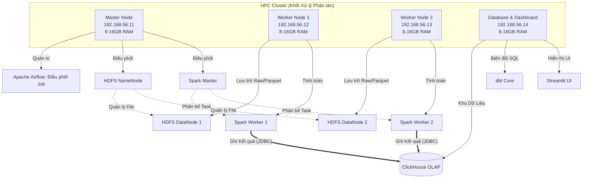
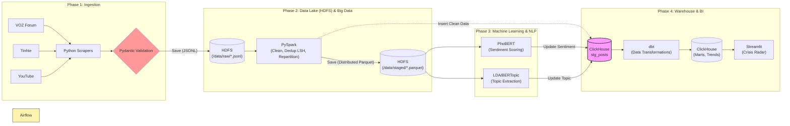

# Bản Thiết Kế Hệ Thống Tổng Thể (System Architecture Design)

Tài liệu này trình bày thiết kế kiến trúc hoàn chỉnh cho dự án **Phân tích Xu hướng & Dư luận mạng xã hội Việt Nam**, bao gồm sơ đồ hạ tầng phần cứng (Infrastructure), luồng dữ liệu (Data Pipeline) và vai trò cụm công cụ thành phần.

---

## 1. Kiến Trúc Hạ Tầng Cụm (Infrastructure Architecture)

Hệ thống được thiết kế theo mô hình **Phân tán (Distributed)** chạy trên 4 máy ảo Ubuntu 22.04 LTS (được quản lý tự động bằng Ansible).

### Chức Năng Từng Node:
- **Master Node:** Là não bộ của cụm. Chạy **Airflow** để thiết lập lịch trình (cron) chạy pipeline mỗi đêm. Giữ **Spark Master** để chỉ đạo các worker và **HDFS NameNode** để quản lý thư mục file phân chuyên sâu.
- **Worker Nodes (1 & 2):** "Công nhân" tính toán chính. Nơi chứa dữ liệu vật lý (DataNode) và bộ nhớ băm của Spark (Spark Worker) để chạy song song thuật toán lọc trùng LSH và Infer PhoBERT.
- **Storage Node:** Nơi mỏ dữ liệu hội tụ. Cài đặt **ClickHouse** với chuẩn siêu CSDL (OLAP) cho phép query Analytics. Đồng thời chạy **Streamlit** Web App trên cổng 8501 để ra mắt người dùng.

---

## 2. Kiến Trúc Luồng Dữ Liệu (Data Pipeline Architecture)

Data pipeline được mô tả thành một băng chuyền xuyên suốt từ đầu vào (Web) tới đầu ra (Biểu đồ vạch).

---

## 3. Bản Đồ Trách Nhiệm (Team Ownership Map)

Kiến trúc chia hệ thống làm 4 layer phân lớp cực kỳ chặt chẽ - phù hợp với chuẩn bài tập lớn môn Xử Lý Song Song/Big Data.

> **1. Data Ingestion Layer (Nhóm Đầu Vào - M1):**
> Chạy hoàn toàn ngoài cụm. Các Script Crawl sẽ lấy raw data mỗi tiếng một lần, đập vào file Validator `schemas/raw_data.py`. Dữ liệu Output chuẩn hóa đẩy thẳng lên file `/data/raw/` của bộ gõ HDFS.

> **2. Big Data & Orchestration Layer (Khung Xương - M2):**
> Góp cấu hình máy ảo. Sau đó Airflow gọi Spark job. Spark load toàn bộ log trong một tuần qua, dùng thuật toán **LSH (Locality-Sensitive Hashing)** phát hiện file text nào bị lặp dập khuôn (Seeding) và khử đi. Trả về chuẩn siêu nén Parquet.

> **3. NLP Layer (Thêm Não Bộ - M3, M4):**
> Lấy Parquet của M2, M3 dùng AI gom nhóm bài viết (VD: Chủ đề "Pin iPhone"). M4 đưa raw text quét qua mô hình ngôn ngữ **PhoBERT** của Việt Nam, gắn cờ tiêu chuẩn: -1 (Chê), 0, 1 (Khen). Ghi thẳng cờ này lồng vào CSDL Data Warehouse.

> **4. Analytics & UI Layer (Nhóm Trình Bày - M5):**
> Từ ClickHouse Data Warehouse, dbt (Data Build Tool) tổng hợp hàng chục triệu row gốc thành các bảng nhỏ gọn nhạy bén `fct_daily_trends`, tính điểm "Hệ số Khủng hoảng" (Crisis Score). Streamlit gọi thẳng bảng này ra để người dùng cuối không bao giờ bị nghẽn lag (Delay nhỏ hơn 1s).

---

## 4. Đặc tả Thuật Toán Lõi CS246/Data Mining

Dự án thể hiện rõ hàm lượng Khoa học qua những cấu trúc thuật toán đắt giá:

- **MinHash & LSH (Locality-Sensitive Hashing):** Xử lý Near-Duplicate. Nếu 2 bình luận có độ giống (Jaccard Similarity) lớn hơn ngưỡng (ví dụ 85%), đánh lặp và chỉ giữ 1 (Anti-Seeding). Áp dụng tính năng tính toán song song RDD/DataFrame qua Spark.
- **Count-Min Sketch (Dành cho Member 3 - Topic Streaming):** Đếm tần suất lượng Topic/Keyword tăng vọt (Stream Data). Đảm bảo O(1) Memory mà vẫn Tracking và Catch được Event bùng cháy của từ khóa mới nổi.
- **Isolation Forest / Z-Score Anomaly detection (Khủng hoảng dư luận):** Algor tính ra điểm dị thường, phát cảnh báo trên màn Dashboard khi volume tăng quá lớn kèm lượng Sentiment là -1.

---

### Tiêu Chuẩn Kết Nối Tích Hợp (Integration Contracts)
Ba mắt xích kết nối cần được giám sát chặt chẽ khi toàn team tích hợp code:
*   [Hợp đồng 1] `Crawler` ➔ `HDFS`: **M1** phải đi qua Pydantic Validation bằng Object UniversalSocialPost, format file đích danh `jsonl`.
*   [Hợp đồng 2] `PySpark` ➔ `ClickHouse`: **M2** tự động Map DataFrame Schema của Dataframe Spark sang schema `stg_posts` đã dựng của Clickhouse DB.
*   [Hợp đồng 3] `NLP` ➔ `ClickHouse`: **M3 & M4** dùng lệnh UPDATE/Batch UPSERT cập nhật 2 trường `sentiment_score` và `topic_label` dựa trên khóa chính là `post_id`.
